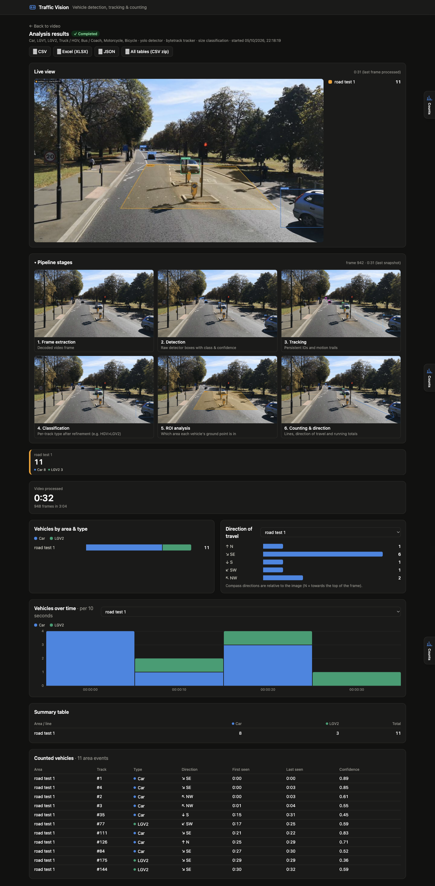

# Traffic Vision

**Traffic Vision** is a video-based vehicle detection, tracking, counting and
traffic-analysis platform. You upload a traffic video, draw areas and counting
lines, choose vehicle types, and get unique-vehicle counts by **area**, **vehicle
type**, **direction** and **time period**. Results export as CSV, XLSX or JSON,
and you can also generate an annotated video.



## Features

- Upload, play back and scrub traffic videos. Codecs the browser can't play are
  shown as frames decoded on the server.
- **Whole Frame** analysis, used automatically when no area is drawn, plus any
  number of **named polygon ROIs** analysed at the same time.
- **Counting lines / gates** with named directions (e.g. "northbound" /
  "southbound").
- Vehicle types: **Car, LGV1 (small van), LGV2 (large van), Truck/HGV,
  Bus/Coach, Motorcycle, Bicycle**. See
  [docs/vehicle-classification.md](docs/vehicle-classification.md).
- Detection with **YOLO** (any Ultralytics model, including custom-trained
  ones), or a **motion detector** for fixed overhead cameras.
- Tracking with **ByteTrack** or **BoT-SORT**. Persistent track IDs mean each
  vehicle is counted **once per area and once per line**.
- **Per-track classification** stage: size rules or a custom crop classifier
  split vans into LGV1/LGV2 and correct mislabelled large vans.
- **Direction of travel** (8-way compass in image space) per area, and
  crossing direction per line.
- **Live progress** over WebSocket, with live provisional counts.
- **Pipeline-stage view**: six panels side by side, updated live while
  processing, showing what each step sees (frame → detection → tracking →
  classification → ROI → counting). The same view can be exported as a 3×2
  "pipeline" video.
- Results dashboard with exports: **CSV**, a zip of all CSV tables, **XLSX**
  (one sheet per table) and **JSON**.
- Optional **annotated video**: boxes, class, track ID, ROIs, lines, direction
  and running counts.

## Counting specific roads

If the camera shows several roads but you only want some of them:

1. Choose **Draw road (rectangle)** and drag a box over each road you want to
   count. Use **Draw area (polygon)** for curved or angled roads.
2. A popup asks for a **name** for each one (e.g. "A40 inbound", "High
   Street"). Names must be unique per video.
3. Each road gets its own **colour**, used in the editor, the live view, the
   annotated video, the counts tiles and the counts drawer.
4. Once you draw a road, **Whole Frame** is switched off, so only your selected
   roads are counted. Tick it again to also get a total for the whole picture.
   Use the checkbox next to a road to leave it out of a run without deleting
   it.

Every vehicle passing through a selected road is counted in that road, split
by vehicle type and direction. The rules:

- **Passing through counts, however fast.** A vehicle whose path goes from outside the box, into
  it and out again is counted, even if it was inside for a single frame or jumped across the box
  between two frames. A vehicle that never enters the box is not counted.
- **Hidden for a moment is still one vehicle.** If a vehicle disappears behind a sign, lamp post or
  another vehicle and comes back with a new tracker ID within 2 s, near where it was heading, it is
  re-linked to its earlier track and counted once.
- **Parked or static things are not traffic.** Tracks that never move (parked cars, a bollard
  misread as a car) are ignored unless **Count parked / stationary vehicles** is ticked.
- **Analyse part of a video.** Set **From / To (seconds)**, e.g. 0 to 20. Times in the results stay
  on the video's own clock. The same vehicle can appear in two roads (for
example, if it turns from one into the other), and it counts once in each.
While an analysis runs, the **Counts** tab on the right edge of the screen
opens a drawer with live per-road counts by vehicle type, and it shows the
final counts afterwards.

*(Optional, API only)* Areas also take a `role` of `in`, `out` or `both`. With
roles set, origin → destination **movements** (turning counts) are reported
too.

## Processing pipeline

```text
Video
  ↓  Frame extraction          app/pipeline/frames.py
  ↓  Vehicle detection         app/pipeline/detector.py      (YOLO | motion)
  ↓  Vehicle tracking          app/pipeline/tracker.py       (ByteTrack | BoT-SORT | IoU)
  ↓  Vehicle classification    app/pipeline/classifier.py    (size rules | crop classifier)
  ↓  ROI / whole-frame analysis app/analysis/analyzer.py
  ↓  Counting & direction      app/analysis/analyzer.py
  ↓  Results                   app/reporting/aggregate.py
  ↓  CSV / XLSX / JSON / video app/reporting/exporters.py, app/pipeline/annotate.py
```

Each stage only consumes the previous stage's output, so any stage can be
swapped out (a new detector, a GPU tracker, a different classifier) without
touching the others. The same vehicle across many frames is one **track**. A
track is counted once in each area it spends at least `min_seconds_in_zone`
in, and once on each line it crosses. One vehicle can therefore legitimately
appear in "Whole Frame", "Lane 1" and "Gate A", but never twice in the same
one.

## Architecture

| Layer | Technology |
|---|---|
| Frontend | React 19, TypeScript, Tailwind CSS 4, HTML5 video, Konva (ROI editor), Vite |
| API | Python, FastAPI, WebSockets |
| Computer vision | OpenCV, Ultralytics YOLO, ByteTrack / BoT-SORT |
| Database | PostgreSQL (SQLite for local development and tests) |
| Processing | Background workers (embedded thread, or separate processes using `SKIP LOCKED` job claiming); CPU or GPU |

Jobs are rows in the `analyses` table. Workers claim queued jobs, write
progress and the latest stage snapshots, then store per-vehicle records
(`zone_counts`, `line_crossings`) and a summary. Each analysis keeps a snapshot
of its settings and ROIs, so editing ROIs later never changes past results.

## Quick start (Docker)

You need [Docker Desktop](https://www.docker.com/products/docker-desktop/) (Windows / macOS) or Docker Engine
with the Compose plugin (Linux). Then:

```bash
git clone https://github.com/bronglil/mhtc-traffic-analyzer.git
cd mhtc-traffic-analyzer
docker compose up --build        # first build takes ~5–10 min (downloads PyTorch + YOLO weights)
```

Open **http://localhost:8080**. Upload a video, draw the roads to count, pick the time range, and click
**Run analysis**.

| Command | What it does |
|---|---|
| `docker compose up -d` | Start in the background (after the first build) |
| `docker compose logs -f worker` | Watch the analysis worker |
| `docker compose up -d --scale worker=3` | Process several videos in parallel |
| `docker compose down` | Stop (videos, results and the database are kept in Docker volumes) |
| `docker compose down -v` | Stop and **delete** all data |

It runs PostgreSQL, the API, a background worker and the web UI. The default YOLO weights are baked
into the image. Put custom weights (e.g. an LGV1/LGV2 model) in the `data` volume under `/data/models/`
and select them in **Advanced settings**. 4K videos work; the detection resolution is chosen
automatically from the video size.

## Local development

```bash
# Backend (Python 3.11+)
cd backend
pip install -r requirements-dev.txt
uvicorn app.main:app --reload          # http://localhost:8000/docs; uses SQLite + an embedded worker

# Frontend
cd frontend
npm install
npm run dev                            # http://localhost:5173 (proxies /api to :8000)
```

Configuration is via `TV_*` environment variables (see `backend/app/config.py`):
`TV_DATABASE_URL`, `TV_DATA_DIR`, `TV_MODEL_PATH`, `TV_CLASSIFIER_MODEL`,
`TV_DEVICE` (`cpu`, `cuda:0`, `mps`), `TV_EMBEDDED_WORKER`.

## Tests

```bash
# Backend
cd backend
pytest                      # everything, including the real-video tests (downloads yolo11n.pt once)
pytest -m "not model"       # skip the tests that need YOLO weights

# Frontend
cd frontend
npm run typecheck           # app + test code
npm test                    # unit tests (Vitest)
npm run test:e2e            # browser tests (Playwright) against a real API + fresh database
                            # first time: npx playwright install chromium
```

GitHub Actions (`.github/workflows/ci.yml`) runs all of these on every push.

Backend:

- `tests/test_analyzer.py`: counting rules (once per zone, re-entry, flicker,
  majority-vote type, lines, direction).
- `tests/test_classifier.py`: class aliases, perspective-normalised LGV1/LGV2
  size rules, crop-classifier voting.
- `tests/test_pipeline.py`: the end-to-end pipeline on a synthetic video with
  all three trackers, stage previews, pipeline video and exports.
- `tests/test_api.py`: upload → ROIs (colours, unique names) → analysis →
  WebSocket → exports.
- `tests/test_multi_road.py`: a 4-road junction
  (`tests/data/videos/synthetic_junction.mp4`, regenerate with
  `tests/data/make_synthetic_junction.py`). Counting only 2 of the 4 roads,
  each road separately by name and vehicle type, and in/out movements.
- `tests/test_real_videos.py`: **real footage with hand-counted ground truth**
  (`tests/data/videos/`):
  - `overhead_road.mp4` (MIT): 5 cars over two lanes and a gate. The motion
    detector matches the ground truth exactly with every tracker. COCO YOLO is
    recorded as a known limitation for overhead views.
  - `oblique_car_park.mp4` (CC BY 4.0): 2 cars and 2 cyclists among
    pedestrians. YOLO11n + ByteTrack matches the counts, types and directions
    exactly.
  - `dual_carriageway.mp4` (MHTC-supplied): a pole-mounted camera over a dual carriageway with a
    slip road. Left carriageway 2 cars (away), slip road 1 car (towards), right carriageway 0. YOLO
    matches exactly with both trackers at strides 1 and 2. The browser test
    `frontend/e2e/real-video.spec.ts` checks the same result through the UI.

  Add your own survey clips (e.g. with LGV1/LGV2 ground truth) by dropping a
  video and a JSON file into that folder. See
  [docs/vehicle-classification.md](docs/vehicle-classification.md#proving-accuracy-ground-truth-clips).

Frontend:

- `src/lib/__tests__/counts.test.ts`: the per-road counts behind the tiles
  and drawer (live vs final, Whole Frame on/off), and the area colour palette
  kept in sync with the backend.
- `e2e/multi-road.spec.ts`: the full user journey in a real browser. It
  uploads the 4-road junction, drags rectangles over 2 roads, names them in
  the popup (duplicate names refused), runs the analysis, and checks the live
  view, the results table (North Road 2, East Road 3, no other roads), the
  counts drawer, the area colours, and the CSV/JSON/XLSX exports. It also
  covers polygon drawing with fast clicks and keyboard safety while the popup
  is open.

## API overview

| Method | Path | Purpose |
|---|---|---|
| `POST` | `/api/videos` | Upload a video (multipart) |
| `GET` | `/api/videos`, `/api/videos/{id}` | List, or get a video with its regions |
| `GET` | `/api/videos/{id}/file`, `/frame?t=` | Stream the video; one decoded frame |
| `POST/PATCH/DELETE` | `/api/videos/{id}/regions[/{rid}]` | Create, rename, edit or delete ROIs and lines |
| `POST` | `/api/videos/{id}/analyses` | Start an analysis (vehicle types, detector, tracker, classification…) |
| `GET` | `/api/analyses/{id}` | Status and summary |
| `WS` | `/api/analyses/{id}/ws` | Live progress and counts |
| `GET` | `/api/analyses/{id}/stages` | Latest pipeline-stage images |
| `GET` | `/api/analyses/{id}/export?format=csv\|csv_bundle\|xlsx\|json` | Download results |
| `GET` | `/api/analyses/{id}/annotated-video` | Annotated or pipeline video |
| `POST` | `/api/analyses/{id}/cancel` | Cancel |

Interactive docs are at `/docs` when the API is running.

## Roadmap

The architecture is designed to extend to speed estimation (homography
calibration on the existing tracks), multiple cameras, OGV1/OGV2 and other
classification schemes, cloud or GPU worker pools, and scheduled automated
reporting.
